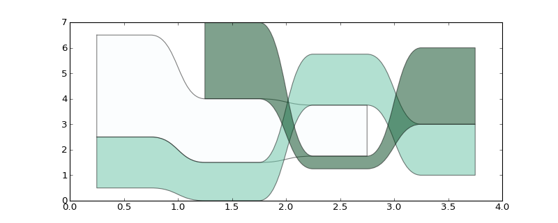

## Basic Usage
> A stream is ultimately just a sequence of values.  
A streamset is a collection of streams.  
Streams have start points and end points defined by their offset and number
of values in the stream.  Streams are useful when you want to visualize 
how a quantity varies (usually over time) as well as it's ranking in a set
of other quantities.
    
    
```python
def simple():
    import matplotlib.pyplot as plt
    import streamgraph2 as sg
    streams = [
        sg.Stream([4.0, 2.5, 2.0,     ]),
        sg.Stream([2.0, 1.5, 2.0, 2.0,]),
        sg.Stream([     3.0, 0.5, 3.0,], offset=1),
    ]
    streamset = sg.StreamSet(streams)
    sg.streamgraph(plt, streamset)

```



## Formatting
> Streams can have a label and custom color and shape formatting.  
Colormaps can be used to automtacially color all the streams 
in a streamset or each stream can be individually colored.
The transitions between values in a stream can be made smoother or sharper
by tweaking the control points.
Padding can be added between streams and a margin can be added to the
streamset.  
The streamset can be aligned within it's bounds.  In the bounds of
the plot axis in can be centered by using `align=0.5`.  

> In the following example
we have harshened the transitions, brashened the colors, and aligned the streams
with the bottom of the plot with `align=0.0`.
    
```python
def formatted():
    import matplotlib.pyplot as plt
    import streamgraph2 as sg
    from matplotlib import cm
    streams = [
        sg.Stream([4.0, 2.5, 2.0,     ], label='gluon'),
        sg.Stream([2.0, 1.5, 2.0, 2.0,], label='muon'),
        sg.Stream([     3.0, 0.5, 3.0,], label='quark', offset=1, 
                facecolor='#ff69b4', edgecolor='b'),
    ]
    streamset = sg.StreamSet(streams, pad=0.5, margin=1.0, align=0.0, 
            facecolors=cm.jet, edgecolors='r')
    fig = plt.figure(figsize=(8, 3))
    sg.streamgraph(plt, streamset, transsize=0.2, transshape=0.1,
            xs='up down charm strange'.split())
    ax = fig.axes[0]
    plt.subplots_adjust(bottom=0.2)
    plt.setp(ax.xaxis.get_minorticklabels(), rotation=45)

```


## Grouping
> One of the more interesting features of this plot is the ability to group a 
set of streams within a stream.  the inner streamgroup can be aligned within the
bounds of the stream in which it is contained.  If the values of a stream
that contains a streamgroup are set to `None`, the stream size will be inferred 
from the sum of its inner streams.  If the `normalize` flag is used, the inner
streams will be proportionately scaled to fit within the bounds of the outer
stream.

> The labels can be moved to a legend on the right by using `legend=True` or a 
float between 0.0 and 1.0 to indicate the relative size of the legend.
    
```python
def group():
    import matplotlib.pyplot as plt
    import streamgraph2 as sg
    from matplotlib import cm
    substreams = [
        sg.Stream([4.0, 2.5, 2.0, 1.0], label='sub1'),
        sg.Stream([2.0, 1.5, 2.0, 2.0], label='sub2'),
        sg.Stream([     3.0, 0.5, 3.0], label='sub3', offset=1),
    ]
    substreamset = sg.StreamSet(substreams, normalize=True, 
            facecolors=cm.gist_gray)
    main_streams = [
        sg.Stream([2.0, 1.5, 2.0, 2.0], label='main1', streamset=substreamset),
        sg.Stream([4.0, 2.5, 2.0, 1.0], label='main2'),
        sg.Stream([     3.0, 0.5, 3.0], label='main3', offset=1),
    ]
    streamset = sg.StreamSet(main_streams, 
            pad=0.2, margin=0.5)
    fig = plt.figure(figsize=(8, 3))
    sg.streamgraph(plt, streamset, legend=0.25)

```


## Recursion
> A streamset can be associated with one of it's own inner streams, setting up
the potential for infinite recursion.  The `RECURSION_LIMIT` value prevents
this.  I'm not sure why anyone would want this except that it does make a
pretty fractal.
    
```python
def braid():
    import matplotlib.pyplot as plt
    import streamgraph2 as sg
    sg.RECURSION_LIMIT = 4
    patt = '''
        123
        213
        231
        321
        312
        132
    '''
    l = [map(float,list(e.strip())) for e in patt.strip().split('\n')]
    a = np.argsort(np.array(l).T,0)+1
    aa = np.hstack((a,a))
    streams = [sg.Stream(aa[i], offset=0) for i in range(3)]
    streamset = sg.StreamSet(streams, pad=0.0, normalize=True)
    streams[1].streamset = streamset
    
    fig = plt.figure(figsize=(14, 2))
    sg.streamgraph(plt, streamset)

```


 
## GDP version 1
> Let's try this out on real-world data: country GDPs.  You'll need pandas for
this example.  China's recent growth is immediately apparant. It is also obvious
that Brazil has been doing well.  Relative GDP are also easily visible, for 
example, Russia and Australia have similar GDP.

    
```python
def gdp_indv():
    import matplotlib.pyplot as plt
    import streamgraph2 as sg
    from matplotlib import cm
    import pandas
    from matplotlib.ticker import FuncFormatter
    
    def trillions(x, pos):
        return '$%1.1fT' % (x*1e-12)
    formatter = FuncFormatter(trillions)

    io = open('gdp.csv')
    df1 = pandas.io.parsers.read_csv(io, index_col=0)
    df2 = df1.pivot('Year', 'Country Code')
    df3 = df2['Value']
    df4 = df3.ix[2001:]
    
    codes = ['USA','JPN','CHN', 'DEU', 'FRA', 'BRA', 'GBR', 'ITA', 'RUS', 'IND', 
            'CAN', 'AUS']
    streams = [sg.Stream(df4[k], label=k) for k in codes]
    streamset = sg.StreamSet(streams, pad=1.0e12, facecolors=cm.Accent)
        
    fig = plt.figure(figsize=(10, 4))
    sg.streamgraph(plt, streamset, xs=df4.index, legend=True)
    ax = fig.axes[0]
    ax.yaxis.set_major_formatter(formatter)

```


## GDP verion 2
> More of the story can be told when we group some of the countries 
into larger economic entities.  In this case we create a streamgroup for the
EU and for North America and it is interesting to note the EU's success as an
entity.
    
```python
def gdp_group():
    import matplotlib.pyplot as plt
    import streamgraph2 as sg
    from matplotlib import cm
    import pandas
    from matplotlib.ticker import FuncFormatter
    
    def trillions(x, pos):
        return '$%1.1fT' % (x*1e-12)
    formatter = FuncFormatter(trillions)
    
    io = open('gdp.csv')
    df1 = pandas.io.parsers.read_csv(io, index_col=0)
    df2 = df1.pivot('Year', 'Country Code')
    df3 = df2['Value']
    df4 = df3.ix[2001:]
    
    codes = ['NAC', 'EUU', 'JPN', 'CHN', 'BRA', 'RUS', 'IND', 'AUS',]
    streams = [sg.Stream(df4[k], label=k) for k in codes]
    
    eu_stream = streams[1]
    codes = ['DEU', 'FRA', 'GBR', 'ITA', ]
    substreams = [sg.Stream(df4[k], label=k) for k in codes]
    eu_stream.streamset = sg.StreamSet(substreams, pad=0, align=0)
    eu_stream.facecolor = '.8'

    na_stream = streams[0]
    codes = ['USA', 'CAN',]
    substreams = [sg.Stream(df4[k], label=k) for k in codes]
    na_stream.streamset = sg.StreamSet(substreams, pad=0, align=0)
    
    mainstreamset = sg.StreamSet(streams, pad=1.0e12, facecolors=cm.Accent)

    fig = plt.figure(figsize=(10, 4))

    sg.streamgraph(plt, mainstreamset, xs=df4.index, legend=True)
    ax = fig.axes[0]
    ax.yaxis.set_major_formatter(formatter)

```

